## ЛР 1 /  K8s 

---

### Установка

---

Minikube успешно поднят внутри VirtualBox

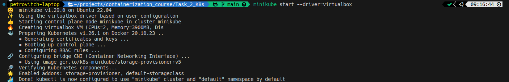

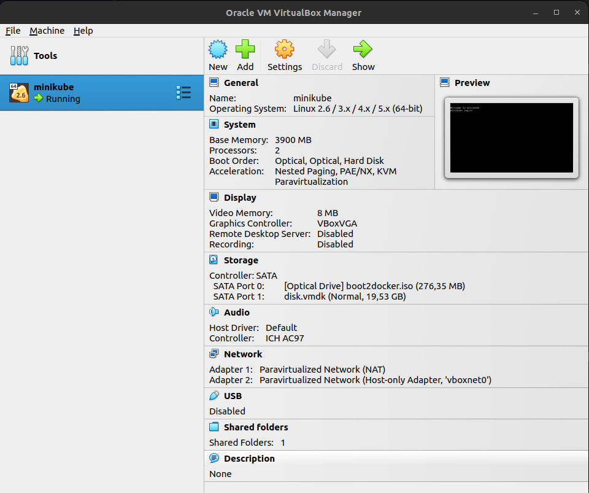

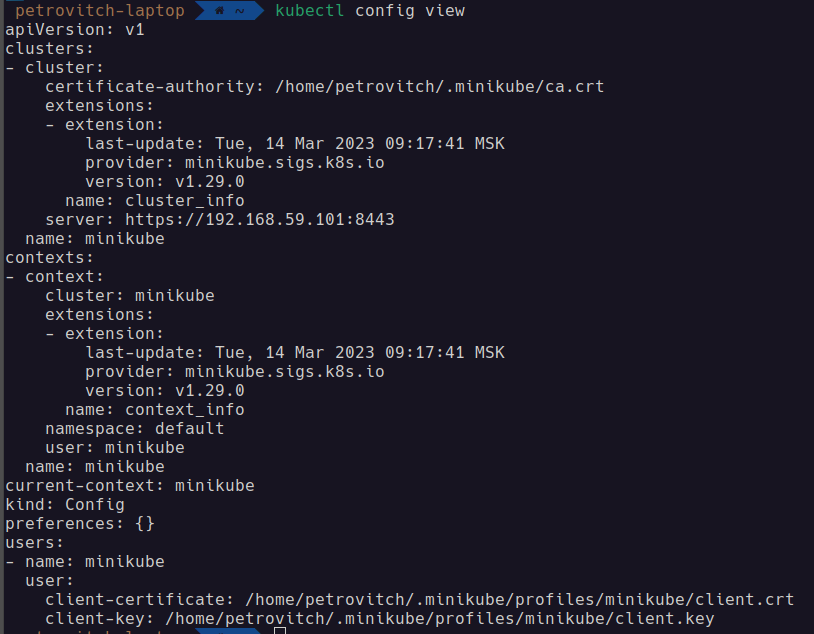

---

### Postgres

---

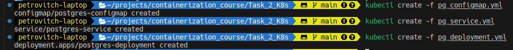

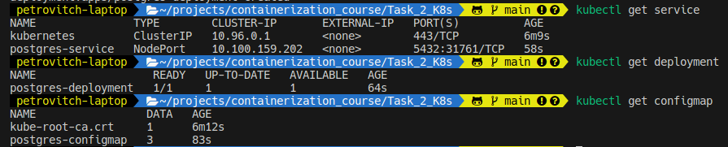

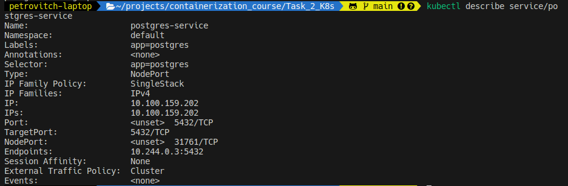

---

💡 Вопрос: важен ли порядок выполнения этих манифестов? Почему?

Ответ: Порядок имеет значение, т.к deployment не поднимется из-за отсутствия configmap'а с нужными ему значениями переменных

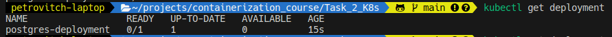

---

### Nextcloud

---

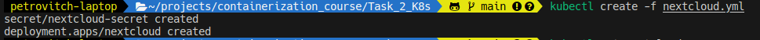

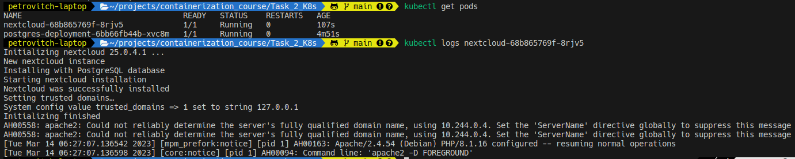

---

### Tunneling

---

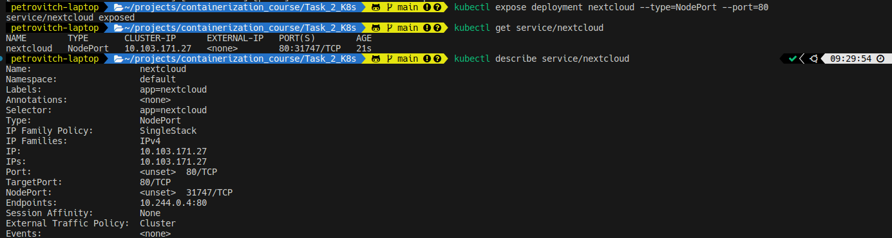

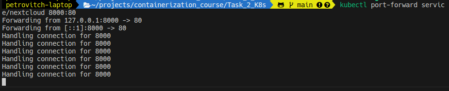

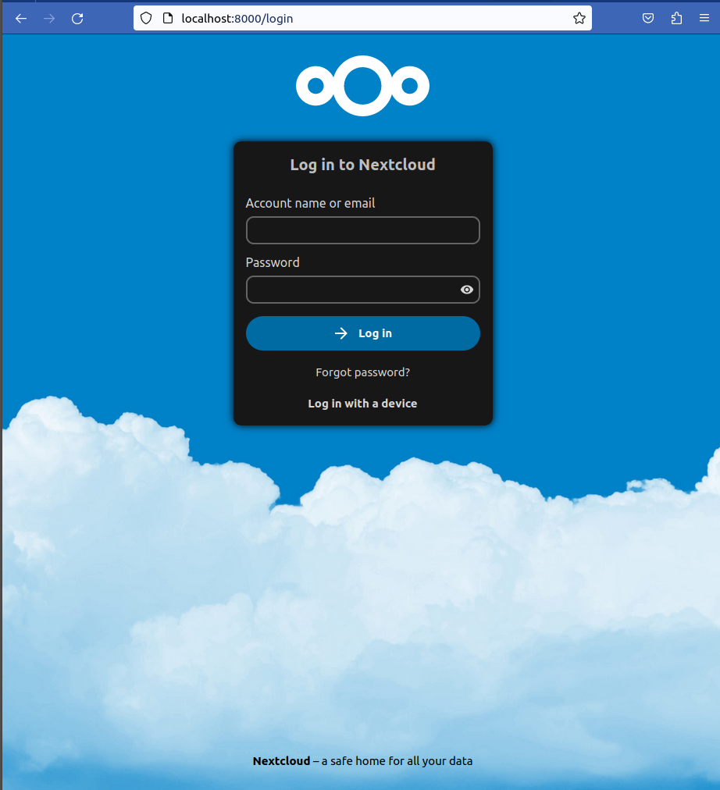

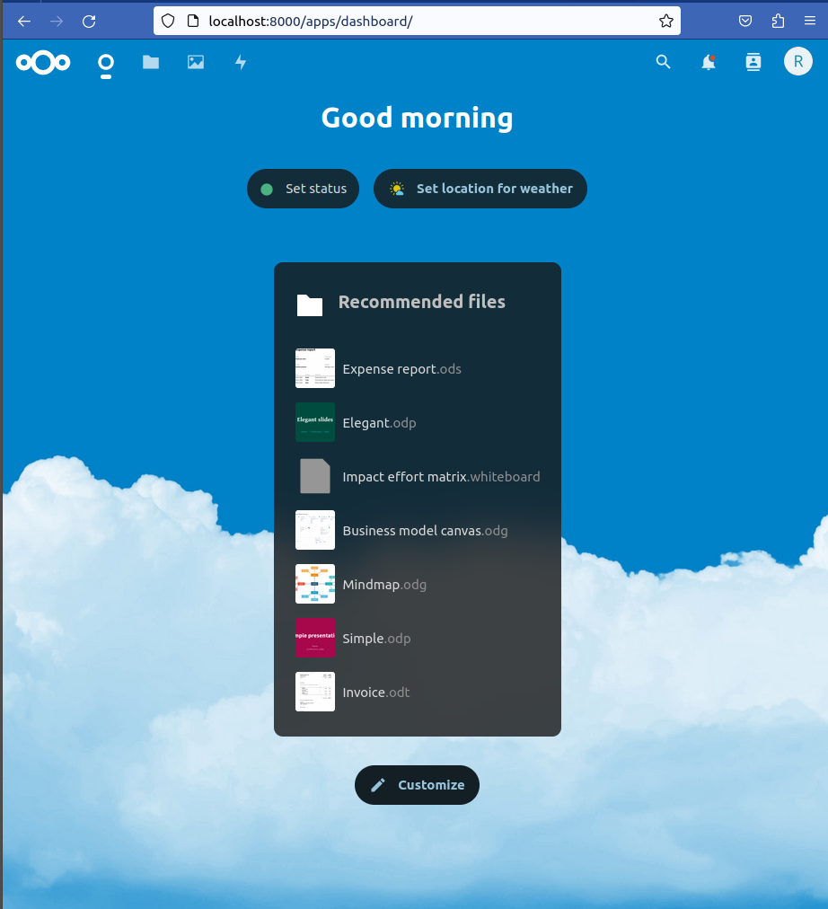

---

### Dashboard

---

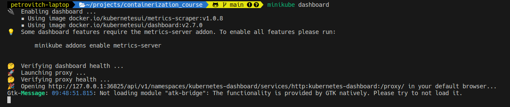

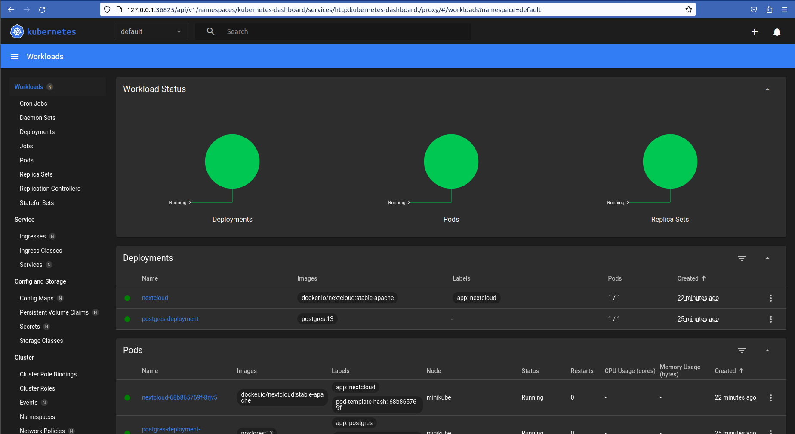

-----

💡 Вопрос: что (и почему) произойдет, если отскейлить количество реплик postgres-deployment в 0, затем обратно в 1, после чего попробовать снова зайти на Nextcloud?

Ответ: Nextcloud упадет с ошибкой 500. Углубленное копание в логи показало начилие ошибки аутентификации на стороне postgres'а, что, вероятно, и является причиной internal server error.

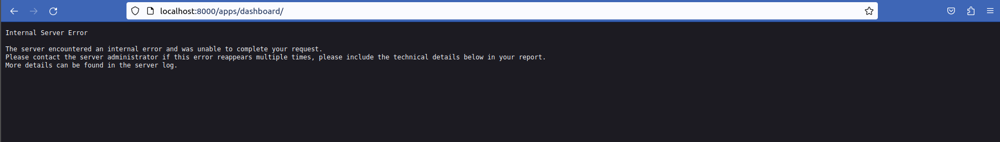

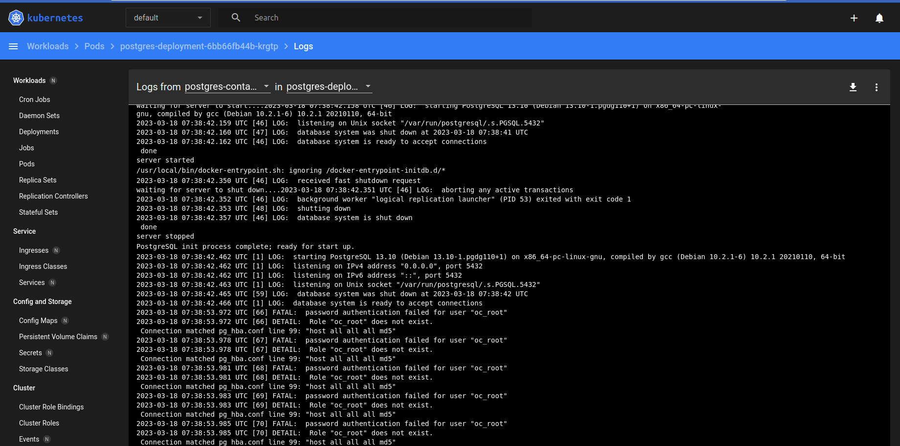

---

